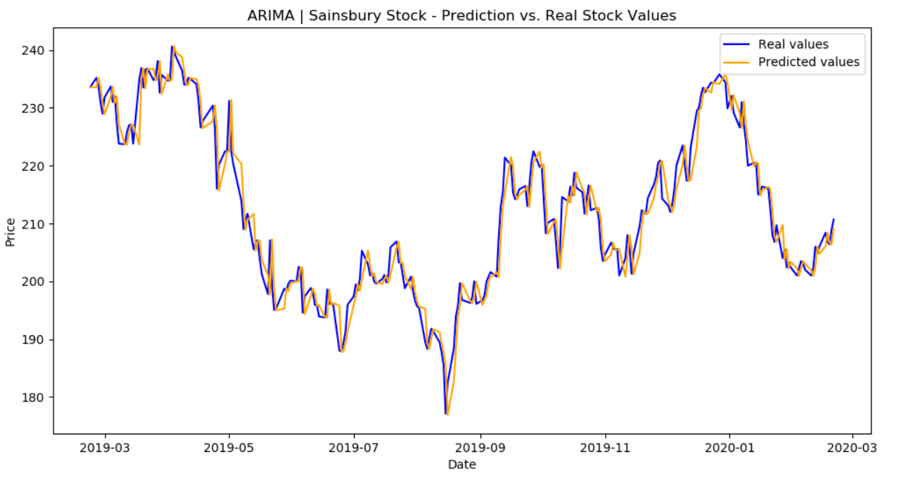
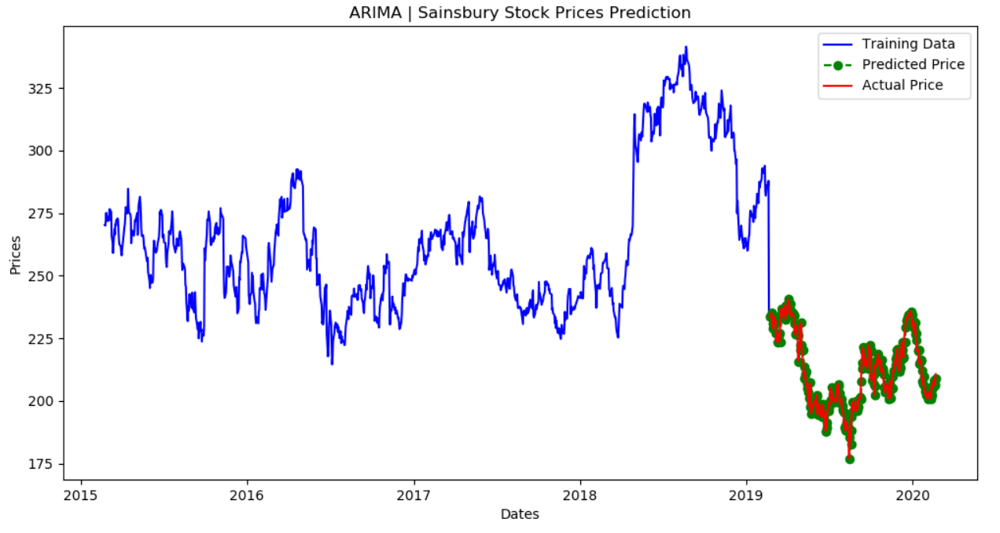
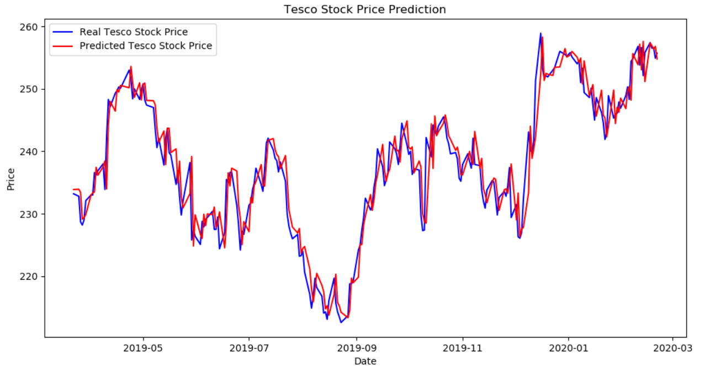
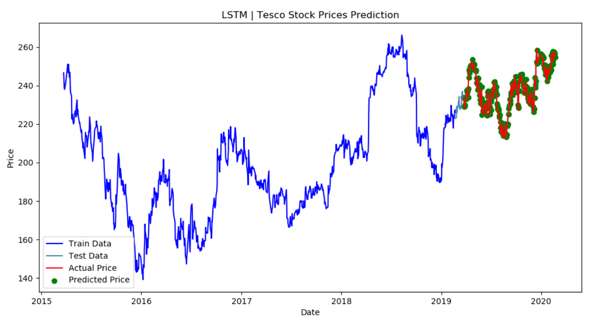

# Stock-Market-Prediction-Using-Machine-Learning

In this project, the main objective is to find the best stock market prediction system to predict the financial
prices of the stock market. This project implements a time series analysis approach that combines with
machine learning algorithms and deep learning techniques. Algorithms that are regression-based such as
linear regression and support vector regression are implemented throughout this project. Moreover, time
series forecasting such as Long Short Term Memory and Autoregressive Integrated Moving Average are
also used in this experiment. Datasets from Yahoo Finance are collected and preprocessed to be fitted into
these models. Historical data includes twelve months and five years of data for Tesco and Sainsbury are
used for the experiment. In addition, the target variable is the close price since it is determined for profit
and loss analysis. Hence, the project is attempting to forecast a close price at a certain time based on the
historical stock prices using different kinds of machine learning models.

Python v3.6.8

Example result:

ARIMA Model on 5 years Sainsbury data

LSTM Model on 5 years Tesco data

Conclusion:

Both LSTM and ARIMA are suitable algorithms for predicting the stock market price based on the historical price data. As other research papers suggested, LSTM and ARIMA do have a lot of potential when dealing with time series forecasting. Hence, these algorithms will be a great asset for traders, investors and analysts to make profitable investment decisions in the stock market. For future work, the idea is to add other variables such as open price, high price, low price, volume and news/sentiment analysis to predict current stock price.

© 2020 Kevin Kurnia Santosa. All rights reserved.
